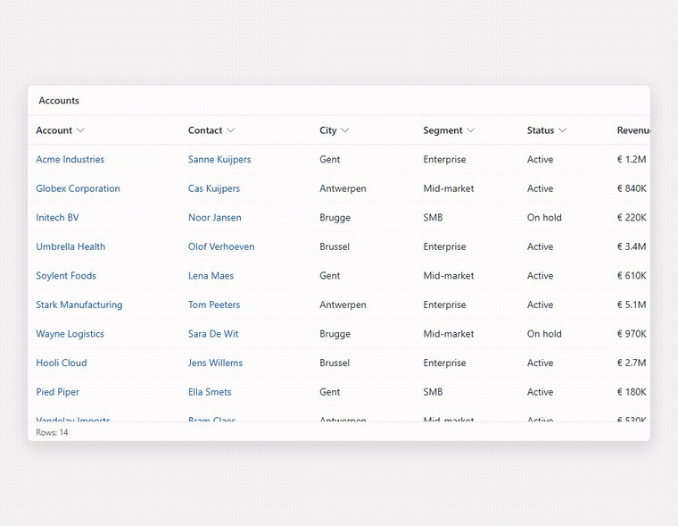

# JJ Read-only Subgrid

A **read-only dataset PCF control** for Power Apps model-driven apps. It replaces the standard editable subgrid with a clean, fast, read-only grid that looks and feels like the native modern grid — but with the command bar (New / Add Existing / Delete) and inline editing intentionally removed.

Built with the [Power Apps Component Framework](https://learn.microsoft.com/power-apps/developer/component-framework/overview), React 16 and Fluent UI v8.

> Logical name in Dataverse: **`jj_Grids.ReadOnlySubgrid`** (publisher prefix `jj`, namespace `Grids`).

<!-- DEMO:START -->

<!-- DEMO:END -->

---

## Why

The out-of-the-box subgrid is editable and shows a command bar. On many forms you want users to **see related records and click through to them, but not create, add, edit or delete from the subgrid**. Hiding the command bar via configuration alone is inconsistent across hosts. This control renders the bound view as a read-only Fluent UI `DetailsList`, so the read-only intent is enforced by the control itself.

## Features

- **Read-only by design** — no command bar, no toolbar, no New/Add/Delete, no inline edit.
- **Native-grid look** — row/header pitch calibrated to the standard Power Apps modern grid (42&nbsp;px), native scrollbars, sticky header.
- **Click-through navigation** — click a row to open the record; lookup cells render as links that open the *related* record (click stops propagation so it never double-opens).
- **Column tools** — per-column dropdown: A→Z / Z→A (server-side sort), Group by / Ungroup, Filter by (client-side contains), Column width dialog, Move left / Move right, drag-resize.
- **Smart paging** — eagerly pre-loads past the host's tiny default page size, then lazy-loads more as you scroll.
- **Lookup-aware** — resolves single, customer, owner and party-list lookups into navigable links.
- **Resilient** — a single malformed record or unreadable column never blanks the whole grid.
- **Localized strings** — Dutch UI labels (easily extendable via the resx).

## Demo

A recorded demo (and the GIF embedded above) shows: opening a record from a row, following a lookup link, sorting, grouping, filtering and resizing columns.

> The GIF is produced from a short screen recording of the control on a live form, converted with `ffmpeg`. See the [Demo & Media](https://github.com/JeroenJonckheer/jj-readonlysubgrid/wiki/Demo-and-Media) wiki page for the exact command.

## Requirements

- [Node.js](https://nodejs.org/) 18+
- [Power Platform CLI (`pac`)](https://learn.microsoft.com/power-platform/developer/cli/introduction)
- A Dataverse environment where you can import controls

## Build

```bash
npm install
npm run build      # production bundle via pcf-scripts
npm run lint       # eslint
npm test           # jest unit + render tests
```

## Deploy

Push the control straight into a Dataverse environment with your publisher prefix:

```bash
pac auth create --environment https://<your-org>.crm.dynamics.com
pac pcf push --publisher-prefix jj
```

This builds and imports the control as `jj_Grids.ReadOnlySubgrid`. After import, edit a form, select a subgrid, and set its control to **Read-only Subgrid**.

> Alternatively, build the managed/unmanaged solution from `Solution/` and import the `.zip`.

## Configure on a form

1. Open the form in the modern form designer.
2. Select (or add) a subgrid bound to the related table + view.
3. In the subgrid properties, choose **Read-only Subgrid** as the control for Web / Phone / Tablet.
4. Save & publish.

The bound view's columns, order and widths drive what the grid shows.

## Project structure

```
ReadOnlySubgrid/
  index.ts                       PCF lifecycle bridge (side effects only)
  components/
    ReadOnlySubgridComponent.tsx Fluent UI rendering + interaction
  gridLogic.ts                   Pure, framework-agnostic data shaping (unit-tested)
  css/ReadOnlySubgrid.css        Native-grid-calibrated styling
  strings/ReadOnlySubgrid.1033.resx  Display strings
  ControlManifest.Input.xml      Control + dataset definition
tests/                           Jest unit (gridLogic) + render tests
Solution/                        Dataverse solution wrapper (.cdsproj)
```

The split is deliberate: **`gridLogic.ts` is pure** (no React/DOM) so it can be unit-tested directly, **the component** owns rendering, and **`index.ts`** owns PCF lifecycle and side effects. See the [Architecture](https://github.com/JeroenJonckheer/jj-readonlysubgrid/wiki/Architecture) wiki page.

## Testing

```bash
npm test
```

- `tests/gridLogic.test.ts` — pure-logic unit tests (column ordering, width resolution, lookup extraction, row building, filtering, grouping, sizing math).
- `tests/ReadOnlySubgridComponent.test.tsx` — render/interaction tests with a mocked dataset (rows, empty/loading states, row & lookup navigation, eager paging).

## Documentation

Full docs live in the [**Wiki**](https://github.com/JeroenJonckheer/jj-readonlysubgrid/wiki):

- [Home](https://github.com/JeroenJonckheer/jj-readonlysubgrid/wiki)
- [Installation & Deployment](https://github.com/JeroenJonckheer/jj-readonlysubgrid/wiki/Installation-and-Deployment)
- [Configuration](https://github.com/JeroenJonckheer/jj-readonlysubgrid/wiki/Configuration)
- [Architecture](https://github.com/JeroenJonckheer/jj-readonlysubgrid/wiki/Architecture)
- [Development & Testing](https://github.com/JeroenJonckheer/jj-readonlysubgrid/wiki/Development-and-Testing)
- [Troubleshooting](https://github.com/JeroenJonckheer/jj-readonlysubgrid/wiki/Troubleshooting)
- [Naming Convention](https://github.com/JeroenJonckheer/jj-readonlysubgrid/wiki/Naming-Convention)

## Author & License

Built by **Jeroen Jonckheer**.

Released under the [MIT License](LICENSE).
